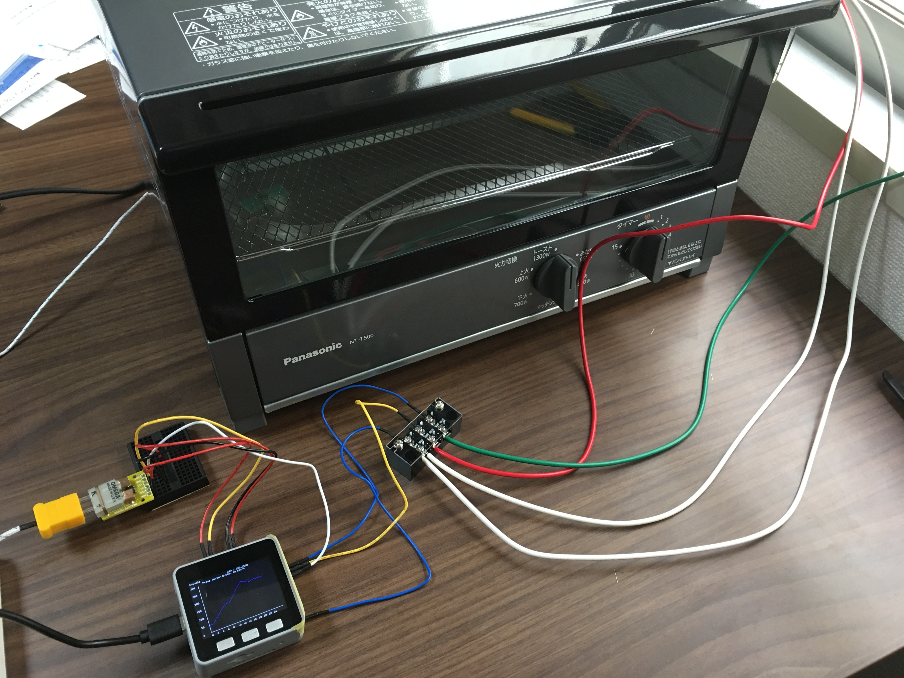
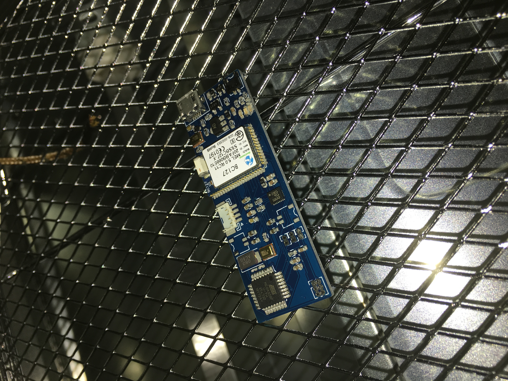

# M5Stack-Reflow-Toaster
M5Stackを使ったコンパクトな家庭用DIYリフローオーブン

## 材料
- トースター
  - [Panasonic NT-T500-K](https://www.amazon.co.jp/gp/product/B00O5WWZU2/ref=oh_aui_detailpage_o02_s00?ie=UTF8&psc=1)などヒーター部が上下二箇所あるもの
- M5Stack
- SSR ×2
  - [CL240D10RC](https://www.digikey.jp/product-detail/ja/sensata-crydom/CL240D10RC/CC2109-ND/2330432)
- K型熱電対
  - [K型熱電対温度センサモジュールキット(SPI接続)MAX31855使用 3.3V版](https://www.switch-science.com/catalog/864/)を使用
- スズメッキ導体シリコンガラス編組線
  - オヤイデなどケーブル専門店で購入可能
- ターミナルなど配線用の資材
  
## セットアップ
// TODO
